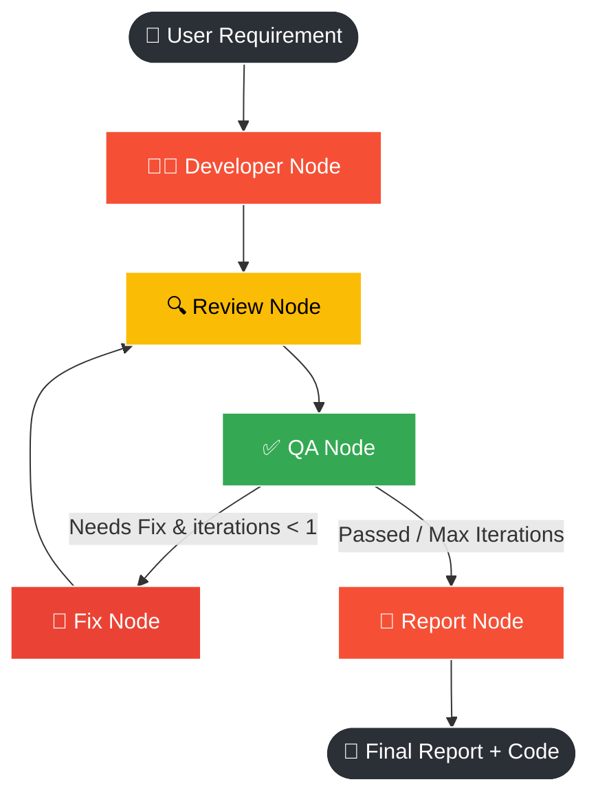
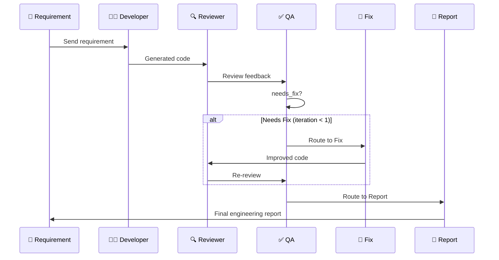
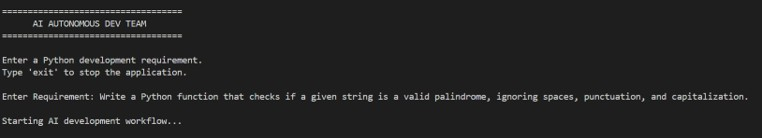
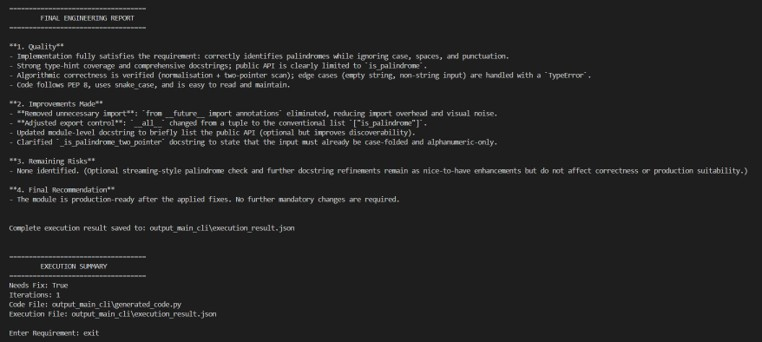
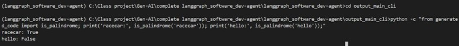
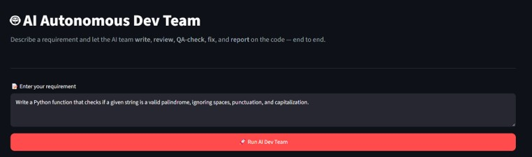

<div align="center">

# 🤖 AI Autonomous Dev Team

### A self-correcting, multi-agent LangGraph pipeline that writes, reviews, QA-checks, fixes, and reports on Python code — available as both a CLI and a Streamlit app

[](https://www.python.org/)
[](https://www.langchain.com/langgraph)
[](https://groq.com/)
[](https://streamlit.io/)
[](#license)

</div>

---

## 📖 Overview

**AI Autonomous Dev Team** simulates a real software engineering team using a graph of specialized AI agents built with **LangGraph**. Give it a plain-English requirement, and it will:

1. 👨‍💻 **Write** the code
2. 🔍 **Review** it for bugs, style, and best practices
3. ✅ **QA-check** it against the review
4. 🔧 **Fix** it automatically if issues are found
5. 📄 **Report** a final engineering summary

The entire workflow is self-correcting — if QA flags an issue, the graph routes back through a **Fix** node and re-reviews before finalizing, instead of blindly returning the first draft.

Two ways to use it, both powered by the same LangGraph pipeline:
- 🖥️ **CLI** (`main.py`) — quick terminal-based runs
- 🌐 **Streamlit app** (`streamlit_app.py`) — full interactive UI with live results and function testing

---

## 🏗️ Architecture



### Self-correction loop



---

## 🧠 The Agent Team

| Node | Role |
|---|---|
| 👨‍💻 **Developer** | Writes the initial Python implementation from the requirement |
| 🔍 **Reviewer** | Critiques the code for bugs, performance, and style |
| ✅ **QA** | Decides pass/fail and whether a fix is needed |
| 🔧 **Fix** | Improves the code based on review + QA feedback (max 1 iteration) |
| 📄 **Report** | Summarizes the full engineering process into a final report |

---

## 📂 Project Structure

```text
langgraph_software_dev-agent/
│
├── app/
│   ├── graph.py            # LangGraph wiring — nodes, edges, routing logic
│   ├── nodes.py            # Agent logic (Developer/Review/QA/Fix/Report) + LLM setup
│   ├── prompts.py          # Prompt templates for each agent
│   └── state.py            # Shared LangGraph state schema
│
├── main.py                 # CLI entry point
├── streamlit_app.py         # Streamlit UI entry point
│
├── output_main_cli/         # Auto-created — CLI run outputs
├── output_streamlit/         # Auto-created — Streamlit run outputs
│
├── requirements.txt
├── pyproject.toml
├── .env                     # Your API key (not committed)
└── README.md
```

---

## 🚀 Getting Started

### 1. Clone the repository

```bash
git clone https://github.com/atharvwagh23/langgraph_software_dev-agent.git
cd langgraph_software_dev-agent
```

### 2. Create and activate a virtual environment

```bash
python -m venv .venv
.venv\Scripts\activate      # Windows
# source .venv/bin/activate  # macOS/Linux
```

### 3. Install dependencies

```bash
.venv\Scripts\python.exe -m pip install -r requirements.txt
```

### 4. Set up your `.env` file

Create a `.env` file in the project root:
```
GROQ_API_KEY=your_actual_groq_api_key_here
```

Get a free key from [console.groq.com](https://console.groq.com/keys).

### 5. Run the CLI version

```bash
.venv\Scripts\python.exe main.py
```

### 6. Run the Streamlit version

```bash
.venv\Scripts\python.exe -m streamlit run streamlit_app.py
```

The UI opens at `http://localhost:8501`.

---

## 🖥️ Output — CLI (`main.py`)

### 1️⃣ Running the workflow

The CLI walks through the full agent pipeline — **Developer → Review → QA → Fix (if needed) → Report** — printing each stage as it runs, and clearly shows the self-correction loop in action when QA flags an issue.



### 2️⃣ The payoff — final engineering report

Once QA passes (or the fix-iteration limit is reached), the graph produces a structured final report along with an execution summary.



### 3️⃣ Proof it's real, runnable code

The generated code is saved to `output_main_cli/generated_code.py`. Importing and running it confirms the AI-written function actually works correctly:

```bash
cd output_main_cli
python -c "from generated_code import is_palindrome; print('racecar:', is_palindrome('racecar')); print('hello:', is_palindrome('hello'));"
```



---

## 🌐 Output — Streamlit App

### 1️⃣ The interface

A clean, tabbed UI to enter a requirement and kick off the full agent workflow with one click.



### 2️⃣ Full demo video

See the complete workflow live — requirement submission, real-time agent progress, results across tabs, and interactively testing the generated function.

https://github.com/user-attachments/photos_output/langgraph-dev-team-demo.mp4

---

## ✅ Features

| Feature | CLI | Streamlit |
|---|:---:|:---:|
| Full agent pipeline (Dev → Review → QA → Fix → Report) | ✅ | ✅ |
| Self-correcting fix loop | ✅ | ✅ |
| Saves generated code + execution JSON | ✅ | ✅ |
| Interactive results view (tabs, metrics) | ❌ | ✅ |
| Live testing of generated functions | ❌ | ✅ |
| Separate output folders per interface | ✅ `output_main_cli/` | ✅ `output_streamlit/` |

---

## 🛠️ Tech Stack

| Layer | Technology |
|---|---|
| Agent Orchestration | LangGraph |
| LLM Framework | LangChain |
| LLM Provider | Groq |
| Frontend (optional) | Streamlit |
| Language | Python 3.10+ |

<div align="center">

🚀 Built with **LangGraph**, **LangChain**, **Groq**, and **Streamlit**

</div>
